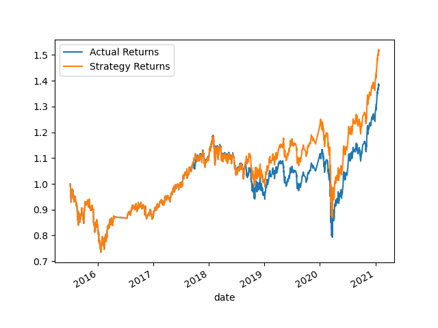
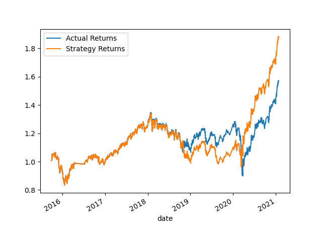
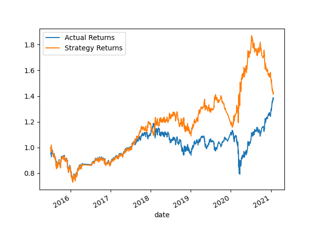

# Machine Learning Trading Bot

In this project, I will create an algorithmic trading bot that learns and adapts to new data and evolving markets. 

In order to establish a baseline performance, I imported the OHLCV dataset into a Pandas DataFrame and generated trading signals using short- and long-window SMA values. I then split the data into training and testing datasets, used the SVC classifier model from SKLearn's support vector machine (SVM) learning method to fit the training data and made predictions based on the testing data. The following plot shows the comparison of cumulative actual returns and strategy returns. 

I tried to tune the model’s input features to find the parameters that result in the best trading outcomes. The following table summarizes the strategy returns with different parameters. 

| Training window    | SMA short window | SMA long window | Strategy return/actual return |
| -------- | ------- | ------- | ------- | 
| 3 months | 4 days | 100 days | 1.097 |
| 2 months | 4 days | 100 days | 1.017 |
| 6 months | 4 days | 100 days | 1.198 |
| 9 months | 4 days | 100 days | 1.015 |
| 24 months | 4 days | 100 days | 1.122 |
| 6 months | 10 days | 100 days | 0.930 |
| 6 months | 2 days | 100 days | 1.053 |
| 6 months | 4 days | 50 days | 0.998 |
| 6 months | 4 days | 200 days | 0.780 |

Changing the training window to 6 and keeping the SMA short and long windows the same give the best result. Here are the optimized returns:

I built a new model using `AdaBoostClassifier` and the returns are:

